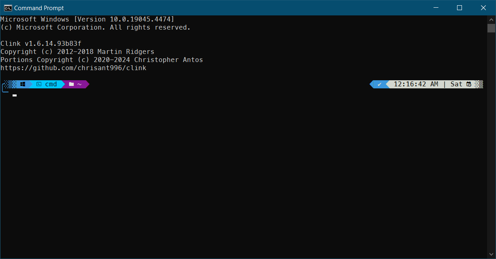

# Automate Command Prompt Configuration Script

* [Download](https://github.com/chrisant996/clink) & Install `Clink`.

* Run As Admin in PowerShell `Set-ExecutionPolicy -ExecutionPolicy RemoteSigned`

* & Then, run `cmd1.ps1` as admin to configure automatically oh-my-posh for Command Prompt with custom themes.

The Screenshot

